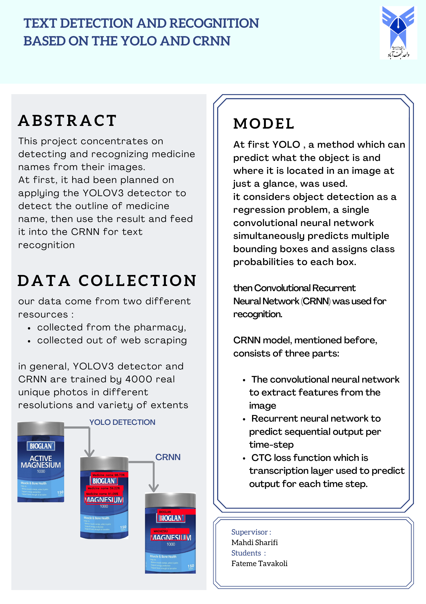

# Drug Container Image Text Extraction

## Project Overview

This repository automates the process of extracting text from images of drug containers. The workflow includes web crawling to collect images, annotating the images, preprocessing the data for YOLO, and using a model to detect text locations and extract the text.

## Repository Structure

- **WebCrawling/**: Scripts and tools to extract images of drug containers from the web.
  
- **Data_Sample/**: sample data of annotating collected images to create labeled datasets.
  
- **Preprocess/**: Scripts for preprocessing annotated images to be used as input for the YOLO model.
  
- **Detect&Recognition/**: Implementation of the model to detect text locations within the images and extract the text.

## Workflow

1. **Web Crawling**: Collect images of drug containers from various online sources using the scripts in the `webcrawling/` folder.
  
2. **Annotation**: Annotate the collected images using the tools in the `annotation/` folder. Follow the sample data provided to maintain consistency.
  
3. **Preprocessing**: Preprocess the annotated images using the tools in the `preprocessing/` folder to ensure they are in the correct format for YOLO.
  
4. **Model Training and Inference**: Train the model using the preprocessed data and use the trained model to detect the location of text and extract it from new images.

## Getting Started

### Prerequisites
- Required Python libraries (listed in `Detect&Recognition/requirements.txt`)

